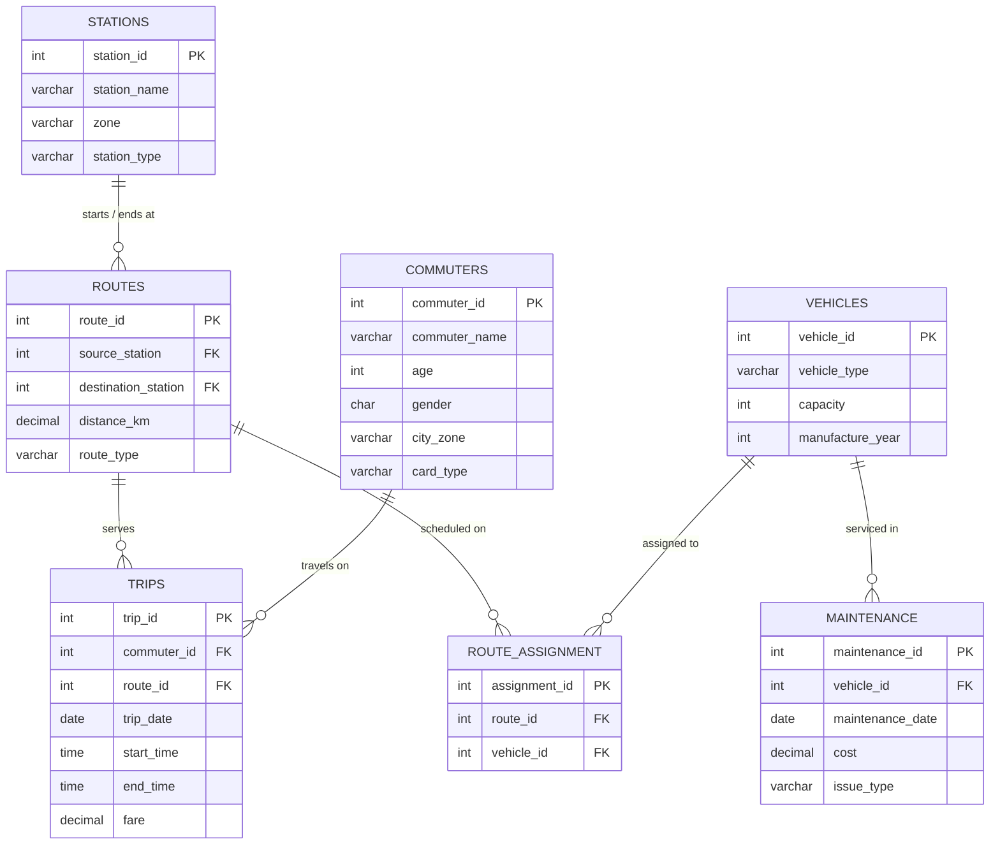

# 🚆 Mumbai Public Transit & Smart Mobility Network

[](https://www.mysql.com/)
[](https://en.wikipedia.org/wiki/SQL)
[](https://github.com/jadavharsh109/mumbai-smart-transit-sql)
[](https://www.linkedin.com/in/harshjadav0901/)
[](LICENSE)

A complete **relational database design and SQL transit analysis project** modeling Mumbai’s public transport system, including Metro trains and Electric Buses. 

It connects stations, travel routes, transit vehicles, passenger demographics, daily trips, and repair maintenance. The goal is to evaluate route profitability, travel times, fleet maintenance costs, and commuter travel passes to help transit planners improve city mobility.

---

## 📑 Table of Contents
- [📌 Project Overview](#-project-overview)
- [📁 Project Files](#-project-files)
- [🗄️ Database Architecture (ER Diagram)](#️-database-architecture-er-diagram)
- [📋 The 7 Database Tables](#-the-7-database-tables)
- [📊 Key Transit & Business Insights](#-key-transit--business-insights)
- [🛠️ SQL Skills Used](#️-sql-skills-used)
- [🚀 How to Run This Project](#-how-to-run-this-project)
- [👨‍💻 Author](#-author)

---

## 📌 Project Overview

Mumbai has one of the busiest public transit networks in the world. Managing both buses and metro trains raises important everyday questions:
* Which routes make the most ticket money, and which need schedule changes?
* How long does an average commuter spend traveling per trip?
* Which vehicles cost the most to repair, and which type is cheaper per passenger seat?
* Are any spare buses sitting idle that could be used during rush hours?

This project builds a clean 7-table relational database from scratch in MySQL, populates it with realistic Mumbai transit data, and answers these operational questions using SQL queries and reporting views.

---

## 📁 Project Files

```
mumbai-smart-transit-sql/
├── data/
│   ├── stations.csv                     # Metro and bus stations across Mumbai
│   ├── routes.csv                       # Routes connecting origin and destination stops
│   ├── vehicles.csv                     # Metro trains and electric buses
│   ├── commuters.csv                    # Passenger profiles, age, zone, and pass type
│   ├── trips.csv                        # Completed journeys, fares, and times
│   ├── route_assignment.csv             # Which vehicle is scheduled to which route
│   └── maintenance.csv                  # Vehicle repair history and costs
├── sql/
│   ├── 01_schema_definition.sql         # Creates tables, primary/foreign keys, and checks
│   ├── 02_data_seed.sql                 # Inserts all sample data and updates
│   ├── 03_views_and_procedures.sql      # Creates reusable views for quick reporting
│   └── 04_transit_analytics.sql         # Analytical queries answering key questions
├── .gitignore                           # Git settings
├── LICENSE                              # MIT License
└── README.md                            # Project documentation
```

---

## 🗄️ Database Architecture (ER Diagram)

The 7 tables are connected using primary and foreign keys to keep data accurate and prevent missing records:



---

## 📋 The 7 Database Tables

1. **`stations`**: Major transit stops (Andheri, Dadar, Borivali, Bandra, Thane, Kurla) labeled as Metro or Bus.
2. **`routes`**: Origin station, destination station, distance in kilometers, and mode (`Metro` or `Bus`).
3. **`vehicles`**: Rolling stock (Metro rakes carrying up to 880 passengers, and Electric Buses carrying 50–55 passengers).
4. **`commuters`**: Passengers with their age, gender, home zone, and pass type (`Monthly Pass`, `Student Pass`, `Senior Citizen`, `Pay Per Ride`).
5. **`trips`**: Completed journeys recording the passenger, route, date, start time, end time, and ticket price.
6. **`route_assignment`**: Connects which physical vehicle operates on which route.
7. **`maintenance`**: Service logs tracking repair dates, parts replaced (brakes, batteries, general service), and costs in rupees.

---

## 📊 Key Transit & Business Insights

Here are the main operational findings discovered from the SQL queries:

### 1. Most Profitable Transit Corridor
* The **Dadar to Borivali Metro route (Route 202)** earned the highest total ticket revenue. 
* Its 22-kilometer distance and strong commuter demand between central and northern Mumbai make it the most profitable line in the network.

### 2. Average Passenger Travel Time
* The average journey duration across all completed trips was **42.5 minutes**.
* Metro lines provided faster travel per kilometer compared to road-based bus routes which faced street traffic.

### 3. Metro vs. Bus Repair Cost per Passenger Seat
* **Metro trains are much cheaper to maintain per passenger seat** than electric buses:
  * **Metro Train:** Costs around **₹13.60 per seat** in maintenance because one train carries 880 passengers.
  * **Electric Bus:** Costs between **₹60.00 and ₹90.00 per seat** in maintenance due to battery and brake servicing for a smaller vehicle (50 passengers).
* *Takeaway:* For high-density routes, investing in metro lines is much more cost-effective per passenger than running dozens of separate buses.

### 4. Backup & Spare Vehicle Detection
* Using a `LEFT JOIN`, the system quickly identified **1 unassigned Electric Bus** that was not scheduled to any active route.
* *Takeaway:* Transit managers can keep this spare vehicle ready as an emergency backup during rush hours or when another bus breaks down.

### 5. Passenger Travel Pass Adoption
* Commuters aged 60 and older were automatically classified for **Senior Citizen discounts**.
* Regular office commuters overwhelmingly use **Monthly Passes** (accounting for over 50% of frequent riders), which ensures guaranteed upfront revenue for the transit authority.

### 6. Busiest Home Zone
* Passengers living in the **North zone (Borivali area)** took the most trips and contributed the highest cumulative ticket fares, confirming that northern suburbs are the main commuter feeder area for Mumbai city centers.

### 7. Fleet Scheduling Efficiency
* Metro trains achieved the highest trips-per-vehicle ratio, completing multiple back-to-back runs with quick turnaround times at terminal stations.

---

## 🛠️ SQL Skills Used

* **Relational Database Design:** Normalization, Primary Keys, Foreign Keys with automatic cascade rules.
* **Data Validation Rules:** `CHECK` constraints ensuring ticket prices are positive and route types are valid.
* **Speed Optimization:** Indexes on trip dates and route IDs for fast lookups.
* **4-Way Table Joins:** Combining trips, routes, vehicle assignments, and vehicle details in a single query.
* **Reporting Views:** Creating saved views (`vw_commuter_profile`, `vw_route_performance`) so dashboards can fetch clean summaries without writing complex joins every time.
* **Window Functions:** Ranking commuters and vehicles by spending and repair costs using `RANK() OVER ()`.
* **Time Calculations:** Using `TIMESTAMPDIFF(MINUTE, start_time, end_time)` to calculate trip durations in minutes.

---

## 🚀 How to Run This Project

### What You Need
* MySQL Server or MySQL Workbench installed on your computer.

### Step-by-Step Instructions
1. **Clone this repository:**
   ```bash
   git clone https://github.com/jadavharsh109/mumbai-smart-transit-sql.git
   cd mumbai-smart-transit-sql
   ```
2. **Create the database and tables:**
   * Run [`sql/01_schema_definition.sql`](sql/01_schema_definition.sql) in MySQL Workbench.
3. **Insert the sample data:**
   * Run [`sql/02_data_seed.sql`](sql/02_data_seed.sql).
4. **Create the reporting views:**
   * Run [`sql/03_views_and_procedures.sql`](sql/03_views_and_procedures.sql).
5. **Run the analysis queries:**
   * Run [`sql/04_transit_analytics.sql`](sql/04_transit_analytics.sql) to see all the operational and revenue insights.

---

## 👨‍💻 Author

**Harsh Jadav**
* 💼 **LinkedIn:** [linkedin.com/in/harshjadav0901](https://www.linkedin.com/in/harshjadav0901/)
* 🐙 **GitHub:** [github.com/jadavharsh109](https://github.com/jadavharsh109)
* 📧 **Email:** [jadavharsh109@gmail.com](mailto:jadavharsh109@gmail.com)

*If this database design and analysis was interesting or useful to you, please give it a ⭐!*
