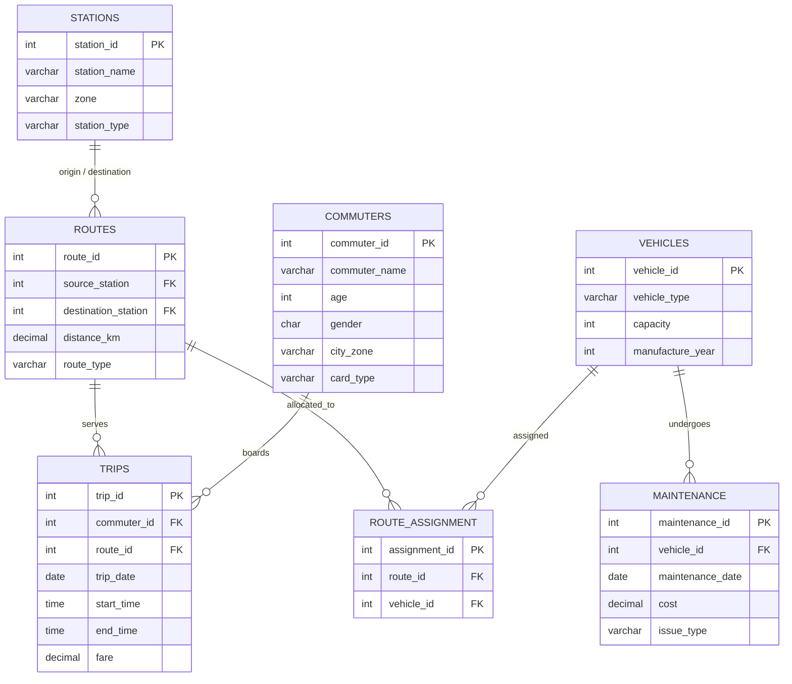

# 🚆 Mumbai Public Transit & Smart Mobility Network

[](https://www.mysql.com/)
[](https://en.wikipedia.org/wiki/SQL)
[](https://github.com/jadavharsh109/mumbai-smart-transit-sql)
[](https://www.linkedin.com/in/harshjadav0901/)
[](LICENSE)

An enterprise-grade **relational database architecture and smart mobility analytics system** modeling Mumbai’s multi-modal urban transit network (Metro rakes and Electric Bus fleets). Features 7 normalized tables, referential integrity constraints, performance indexes, reusable reporting views, and advanced analytical queries evaluating commuter mobility, route profitability, and vehicle maintenance economics.

---

## 📑 Table of Contents
- [📌 Problem Statement & Architecture Goals](#-problem-statement--architecture-goals)
- [📁 Project Structure](#-project-structure)
- [🗄️ Relational Entity-Relationship (ER) Architecture](#️-relational-entity-relationship-er-architecture)
- [📋 Schema Data Dictionary](#-schema-data-dictionary)
- [👁️ Reusable Reporting Views](#️-reusable-reporting-views)
- [📊 Key Transit KPIs & Operational Insights](#-key-transit-kpis--operational-insights)
  - [1. Multi-Table Relational 4-Way JOIN](#1-multi-table-relational-4-way-join)
  - [2. Highest Revenue Transit Routes](#2-highest-revenue-transit-routes)
  - [3. Spare Fleet Detection (LEFT JOIN)](#3-spare-fleet-detection-left-join)
  - [4. Commuter Spend Segmentation (Window Functions)](#4-commuter-spend-segmentation-window-functions)
  - [5. Vehicle Maintenance Cost per Seat](#5-vehicle-maintenance-cost-per-seat)
  - [6. Fleet Operational Utilization Ratio](#6-fleet-operational-utilization-ratio)
- [🛠️ Database Administration & SQL Highlights](#️-database-administration--sql-highlights)
- [🚀 Quickstart & Setup Guide](#-quickstart--setup-guide)
- [👨‍💻 Author](#-author)

---

## 📌 Problem Statement & Architecture Goals

Mumbai operates one of the world's highest-density urban transportation networks. Managing multi-modal operations across Metro lines and feeder bus routes presents core engineering challenges:
1. **Referential Integrity:** Ensuring trip records correctly map to active commuters, routes, and operational rolling stock.
2. **Fleet Allocation:** Identifying unassigned or underutilized transit vehicles while tracking preventative maintenance costs.
3. **Route Profitability:** Evaluating revenue per kilometer and route load factors to optimize scheduling and frequency.
4. **Commuter Profiling:** Segmenting travelers across pass categories (`Monthly Pass`, `Student Pass`, `Senior Citizen`, `Pay Per Ride`) to forecast farebox cashflow.

---

## 📁 Project Structure

```
mumbai-smart-transit-sql/
├── data/
│   ├── stations.csv                     # Transit stations (Metro & Bus terminals)
│   ├── routes.csv                       # Origin-destination route definitions & distance
│   ├── vehicles.csv                     # Rolling stock (Metro trains & Electric buses)
│   ├── commuters.csv                    # Commuter demographics and transit pass tiers
│   ├── trips.csv                        # Completed transit trips, timestamps & fares
│   ├── route_assignment.csv             # Operational vehicle-to-route mappings
│   └── maintenance.csv                  # Preventative & corrective maintenance logs
├── sql/
│   ├── 01_schema_definition.sql         # Normalized DDL schema, PK/FK, CHECK constraints & indexes
│   ├── 02_data_seed.sql                 # DML seed data and simulated fleet expansion updates
│   ├── 03_views_and_procedures.sql      # Reusable views (vw_commuter_profile, vw_route_performance)
│   └── 04_transit_analytics.sql         # 14 advanced operational KPI and window function queries
├── .gitignore                           # Clean git configuration
├── LICENSE                              # MIT License
└── README.md                            # Comprehensive project documentation
```

---

## 🗄️ Relational Entity-Relationship (ER) Architecture



---

## 📋 Schema Data Dictionary

| Table | Primary Key | Foreign Keys | Key Constraints & Indexes |
| :--- | :--- | :--- | :--- |
| **`stations`** | `station_id` | *None* | `station_type` (`Metro`, `Bus`) |
| **`routes`** | `route_id` | `source_station`, `destination_station` | `CHECK (route_type IN ('Metro', 'Bus', 'Train'))` |
| **`vehicles`** | `vehicle_id` | *None* | `CHECK (capacity > 0)` |
| **`commuters`**| `commuter_id`| *None* | `CHECK (gender IN ('M', 'F', 'O'))` |
| **`trips`** | `trip_id` | `commuter_id`, `route_id` | `CHECK (fare > 0)`, Indexes on `trip_date` & `route_id` |
| **`route_assignment`** | `assignment_id` | `route_id`, `vehicle_id` | Cascade delete on route or vehicle termination |
| **`maintenance`** | `maintenance_id` | `vehicle_id` | `CHECK (cost >= 0)` |

---

## 👁️ Reusable Reporting Views

To decouple reporting dashboards from underlying physical tables, three optimized database views are defined in [`03_views_and_procedures.sql`](sql/03_views_and_procedures.sql):

1. **`vw_commuter_profile`**: Aggregates rider frequency, cumulative fare spend, and average fare per trip by pass type and residential zone.
2. **`vw_route_performance`**: Pre-computes trip volumes, gross route earnings, and **revenue per kilometer** metrics.
3. **`vw_vehicle_fleet_health`**: Calculates fleet maintenance cost normalized per seat.

---

## 📊 Key Transit KPIs & Operational Insights

### 1. Multi-Table Relational 4-Way JOIN
* **Objective:** Trace individual commuter trips through routes, vehicle assignments, and physical rolling stock.
* **SQL Query:**
```sql
SELECT 
    t.trip_id,
    t.trip_date,
    t.fare,
    r.route_id,
    r.route_type,
    v.vehicle_id,
    v.vehicle_type,
    v.capacity
FROM trips t
JOIN routes r ON t.route_id = r.route_id
JOIN route_assignment ra ON r.route_id = ra.route_id
JOIN vehicles v ON ra.vehicle_id = v.vehicle_id;
```

---

### 2. Highest Revenue Transit Routes
* **Objective:** Determine the top-performing transit corridor by total fare collections.
* **SQL Query:**
```sql
SELECT 
    r.route_id, 
    r.route_type,
    s1.station_name AS source_station,
    s2.station_name AS destination_station,
    SUM(t.fare) AS total_revenue
FROM routes r
JOIN stations s1 ON r.source_station = s1.station_id
JOIN stations s2 ON r.destination_station = s2.station_id
JOIN trips t ON r.route_id = t.route_id
GROUP BY r.route_id, r.route_type, s1.station_name, s2.station_name
ORDER BY total_revenue DESC
LIMIT 1;
```

---

### 3. Spare Fleet Detection (LEFT JOIN)
* **Objective:** Identify rolling stock not currently scheduled to any active route assignment for standby availability.
* **SQL Query:**
```sql
SELECT v.vehicle_id, v.vehicle_type, v.capacity, v.manufacture_year
FROM vehicles v
LEFT JOIN route_assignment ra ON v.vehicle_id = ra.vehicle_id
WHERE ra.vehicle_id IS NULL;
```

---

### 4. Commuter Spend Segmentation (Window Functions)
* **Objective:** Rank top riders across the transit network without row group collapse.
* **SQL Query:**
```sql
SELECT commuter_id, commuter_name, total_spent, spending_rank
FROM (
    SELECT 
        c.commuter_id, 
        c.commuter_name,
        SUM(t.fare) AS total_spent,
        RANK() OVER (ORDER BY SUM(t.fare) DESC) AS spending_rank
    FROM commuters c
    JOIN trips t ON c.commuter_id = t.commuter_id
    GROUP BY c.commuter_id, c.commuter_name
) AS ranked_commuters
WHERE spending_rank <= 5;
```

---

### 5. Vehicle Maintenance Cost per Seat
* **Objective:** Determine which vehicle classification delivers the lowest maintenance overhead per passenger seat.
* **SQL Query:**
```sql
SELECT 
    v.vehicle_type,
    SUM(m.cost) AS total_maintenance_cost,
    AVG(v.capacity) AS avg_capacity,
    ROUND(SUM(m.cost) / AVG(v.capacity), 2) AS maintenance_cost_per_seat
FROM vehicles v
JOIN maintenance m ON v.vehicle_id = m.vehicle_id
GROUP BY v.vehicle_type
ORDER BY maintenance_cost_per_seat ASC
LIMIT 1;
```

---

### 6. Fleet Operational Utilization Ratio
* **Objective:** Calculate the route with the highest completed trip-to-assigned-vehicle ratio.
* **SQL Query:**
```sql
SELECT 
    r.route_id, 
    r.route_type,
    COUNT(DISTINCT t.trip_id) AS total_trips,
    COUNT(DISTINCT ra.vehicle_id) AS assigned_vehicles,
    ROUND(COUNT(DISTINCT t.trip_id) / COUNT(DISTINCT ra.vehicle_id), 2) AS trips_per_vehicle
FROM routes r
JOIN trips t ON r.route_id = t.route_id
JOIN route_assignment ra ON r.route_id = ra.route_id
GROUP BY r.route_id, r.route_type
ORDER BY trips_per_vehicle DESC
LIMIT 1;
```

---

## 🛠️ Database Administration & SQL Highlights

* **Referential Integrity Enforcement:** Foreign Keys ensure orphaned trips, unmapped routes, and invalid maintenance records cannot be inserted.
* **Performance Indexing:** Indexes created on high-cardinality foreign keys (`idx_trip_date`, `idx_trip_route`) to optimize query execution plans.
* **Domain Check Constraints:** `CHECK (route_type IN ('Metro', 'Bus'))` and `CHECK (fare > 0)` enforce business data validation at the storage layer.
* **Window Functions:** Applied `RANK() OVER (ORDER BY ...)` for analytical reporting and dynamic ranking without subquery overhead.
* **Temporal Calculations:** Utilized `TIMESTAMPDIFF(MINUTE, start_time, end_time)` for precise transit trip duration benchmarking.

---

## 🚀 Quickstart & Setup Guide

### Prerequisites
* **MySQL Server 8.0+** or **MySQL Workbench** installed locally.
* Git installed on your machine.

### Step 1: Clone the Repository
```bash
git clone https://github.com/jadavharsh109/mumbai-smart-transit-sql.git
cd mumbai-smart-transit-sql
```

### Step 2: Initialize Database Schema
```sql
SOURCE sql/01_schema_definition.sql;
```

### Step 3: Seed Data & Apply Transformations
```sql
SOURCE sql/02_data_seed.sql;
```

### Step 4: Create Reusable Reporting Views
```sql
SOURCE sql/03_views_and_procedures.sql;
```

### Step 5: Execute Analytics Queries
```sql
SOURCE sql/04_transit_analytics.sql;
```

---

## 👨‍💻 Author

**Harsh Jadav**
* 💼 **LinkedIn:** [linkedin.com/in/harshjadav0901](https://www.linkedin.com/in/harshjadav0901/)
* 🐙 **GitHub:** [github.com/jadavharsh109](https://github.com/jadavharsh109)
* 📧 **Email:** [jadavharsh109@gmail.com](mailto:jadavharsh109@gmail.com)

*If you found this database architecture useful, please consider giving this repository a ⭐!*
